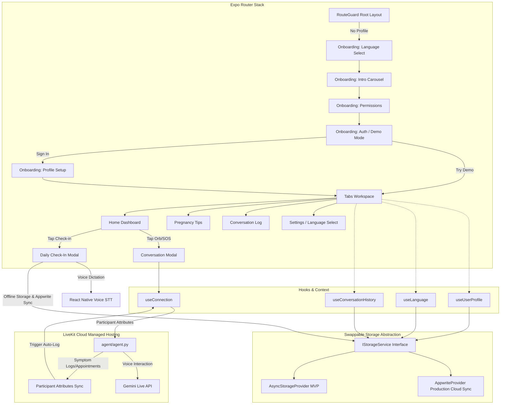

<p align="center">
  
</p>

<h1 align="center">SheGuard AI</h1>

<p align="center">
  <strong>A Voice-First Multilingual Maternal Health Companion for Expectant Mothers</strong>
</p>

---

## 📖 Overview

**SheGuard AI** is a real-time voice assistant and offline-capable mobile health companion built with React Native (Expo) and LiveKit Cloud. It is designed to support expectant mothers in Nigeria, particularly in underserved communities, by detecting early danger signs (including preeclampsia) and offering trimester-appropriate, culturally sensitive prenatal guidance.

SheGuard interacts naturally in multiple local languages:
* **English**
* **Nigerian Pidgin English** (e.g., *"How you dey? No worry, I dey here for you."*)
* **Yoruba**
* **Hausa**
* **Igbo**

---

## 🚀 Key Features

### 1. Real-Time Multilingual Voice Assistant
* Powered by LiveKit Cloud Agents running the **Gemini Live API** (`gemini-2.5-flash-native-audio-preview-12-2025`) with a warm, empathetic female voice (`Aoede`).
* Dynamically syncs the user's preferred language on call start via participant attributes.

### 2. Daily Health Check-In & Symptom Tracking
* Log daily moods (Great, Good, Tired, Unwell, Anxious) and check for common maternal symptoms.
* Integrated **Speak to Write** offline speech-to-text dictation button next to notes, powered by `@react-native-voice/voice`.
* **Preeclampsia Risk Warnings**: Automatically raises a prominent alert badge if critical warning signs (severe headache, swelling of hands/face, blurred vision) are logged, prompting users to connect to the assistant or seek emergency medical care.

### 3. Chronological Maternal Health Journal
* A single, unified feed combining offline daily check-in logs, danger flags, and full LiveKit voice call transcripts.
* Retains full records locally (`AsyncStorage`) and syncs in real-time with Appwrite Cloud.

### 4. Month-by-Month Pregnancy Tips
* Groups pregnancy guidelines strictly into **9 Expandable Month Accordions** (Weeks 1 to 40+) rather than broad trimesters.
* Offers one-click voice readers to narrate guides in the selected language.

### 5. Real-Time Hospital & Clinic Locator
* geolocates the user's current coordinates using native `expo-location`.
* Queries OpenStreetMap's **Overpass API** natively to return maternity clinics and hospitals within a 15km radius.
* Supports offline caching (cache-first load if location remains within 3km) and area filtering.

### 6. Interactive AI Agent Tools
* **`log_symptoms(symptoms)`**: Agent updates session attributes to automatically register maternal symptoms in the user's journal.
* **`schedule_appointment(title, datetime_str)`**: Agent updates session attributes to schedule upcoming prenatal clinic visits in the user's calendar.

---

## 🛠️ System Architecture



---

## ⚙️ Environment Configuration

Create a `.env` file in the project root:

```env
# LiveKit Cloud Connection URL
EXPO_PUBLIC_LIVEKIT_URL="wss://your-project-subdomain.livekit.cloud"

# (Optional) Static connection token for local testing. Leave empty in production to use dynamic Appwrite tokens.
EXPO_PUBLIC_LIVEKIT_TOKEN=""

# Agent name designation
EXPO_PUBLIC_LIVEKIT_AGENT_NAME="sheguard-ai"
```

Configure agent credentials inside `agent/.env` (used during local testing/creation):

```env
LIVEKIT_URL=wss://your-project-subdomain.livekit.cloud
LIVEKIT_API_KEY=your-api-key
LIVEKIT_API_SECRET=your-api-secret
GOOGLE_API_KEY=your-gemini-api-key
```

---

## 📦 Appwrite Setup & Database Schema

The app uses Appwrite for user profiles, transaction logs, and serverless token generation.

### Database: `sheguard`

1. **Collection `profiles`**
   - Attributes: `user_id` (string), `display_name` (string), `language` (string), `pregnancy_month` (integer), `due_date` (string), `is_demo` (boolean), `emergency_contacts` (string, array), `created_at` (string).
2. **Collection `conversations`**
   - Attributes: `conversation_id` (string), `user_id` (string), `room_name` (string), `started_at` (string), `ended_at` (string), `had_emergency` (boolean), `messages_json` (string, LongText).
3. **Collection `appointments`**
   - Attributes: `appointment_id` (string), `user_id` (string), `title` (string), `datetime` (string), `location` (string), `completed` (boolean).

### Serverless LiveKit Token Generator
Deploy an Appwrite Function named `generate-livekit-token` (Node.js 22 runtime) containing the `livekit-server-sdk` dependency to securely yield credentials on client demand without exposing secrets in the APK.

---

## 🌐 LiveKit Cloud Agent Deployment

SheGuard agent runs on LiveKit Cloud Managed Agents hosting. To build and deploy new code versions directly to the cloud without maintaining separate hosting servers:

```bash
# Move to the agent directory
cd agent

# Register and deploy the agent configuration to LiveKit Cloud (silently/non-interactively)
lk agent create --region us-east --secrets-file .env --silent .
```

This generates/updates the [livekit.toml](file:///home/zeez/gitcloned/agent-starter-react-native/agent/livekit.toml) configuration file and uploads the project container based on [Dockerfile](file:///home/zeez/gitcloned/agent-starter-react-native/agent/Dockerfile).

---

## 📱 Compiling Standalone Android Builds

### Development Build (Requires Metro Metro Bundler)
```bash
bun install
npx expo run:android
```

### Production Release APK (Standalone Offline Bundle)
To generate the production APK that connects directly to Appwrite Cloud and LiveKit Cloud (without Metro dependencies):
```bash
cd android
./gradlew assembleRelease
```
The output standalone binary is built at:  
`android/app/build/outputs/apk/release/app-release-unsigned.apk` (or signed path).
